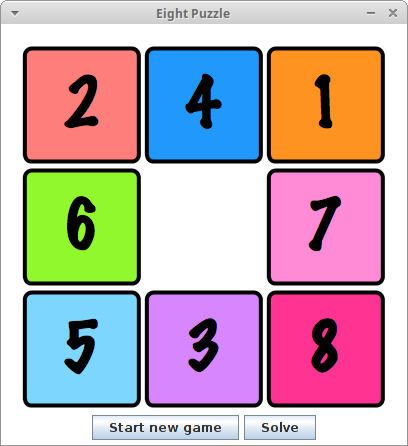

# EightPuzzle + AI solver

This is an implementation of the 8-puzzle problem written in Java and using Swing, while the solver is implemented using the A* search algorithm.

The 8-puzzle problem is a game played on a 3-by-3 grid labeled 1 through 8 and a blank square.
The goal of the game is to rearrange the blocks so that they are in order, but you are only allowed to swap the blank square with an adjacent one.

## Screenshots

 

## Running
To run the game, download [Eightpuzzle.jar](EightPuzzle.jar) and run it: ```java -jar EightPuzzle.jar```.

## License

This project is licensed under the [MIT License](./LICENSE.md).
